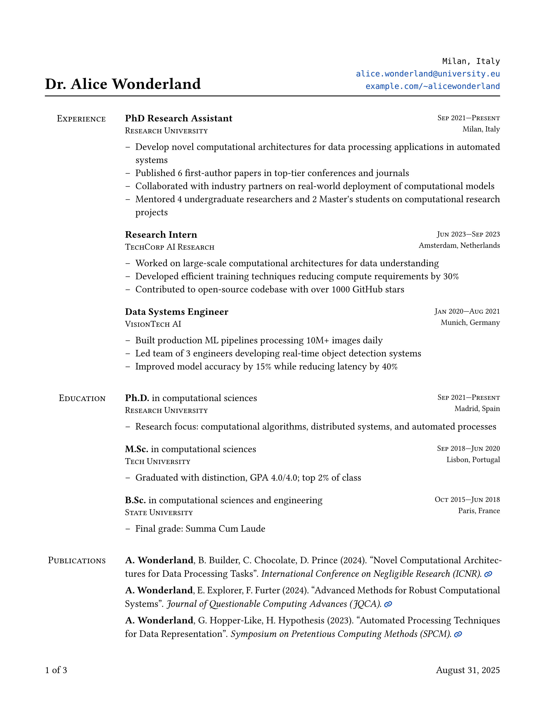
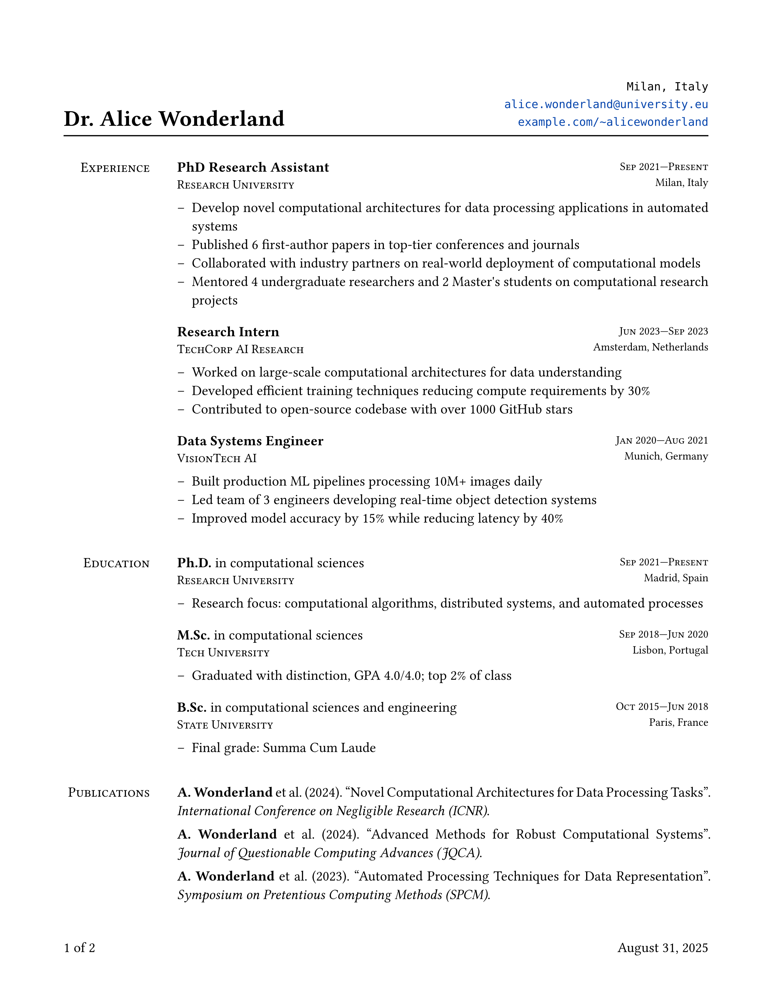

# Typst CV Template

A professional, production-ready CV template built with Typst following official template best practices. Features intelligent data filtering, unified configuration system, and highly customizable output variants.

|Academic|Industry|Short|
|:-:|:-:|:-:|
||||

## Features

- **Template Architecture** - Built using official Typst template structure for maximum reusability
- **Smart Filtering** - Intelligent sorting and filtering across all sections (publications, experience, education)
- **Unified Configuration** - Single, clean config system with clear precedence rules
- **Multiple Variants** - Generate academic, industry, or compact CVs from the same data
- **Ultra-Simple Usage** - 16-line main file, everything else handled automatically
- **Production Ready** - Robust error handling, comprehensive filtering, and clean architecture

## Quick Start

```bash
# Clone and build academic CV
git clone <repo-url>
cd resume-typst
make academic

# Build all variants
make all

# Development with auto-reload  
make watch
```

## Project Structure

```
├── build/
│   └── cv.typ              # Main build file
├── data/
│   ├── config.yaml         # Base configuration
│   ├── personal.yaml       # Contact information
│   ├── sections/           # Content modules
│   │   ├── experience.yaml
│   │   ├── education.yaml
│   │   ├── publication.yaml
│   │   └── ...
│   └── variants/           # Variant-specific overrides
│       ├── academic.yaml   # Complete academic CV
│       ├── industry.yaml   # Industry-focused filtering  
│       └── short.yaml      # Ultra-compact version
├── lib/                    # Template system
│   ├── template.typ        # Main template function
│   ├── config.typ          # Configuration merging
│   ├── data.typ           # Data loading & filtering
│   ├── components.typ      # Reusable components
│   ├── renderers.typ       # Section renderers
│   └── styles.typ          # Typography utilities
└── out/                    # Generated PDFs
```

## Requirements

- [Typst](https://github.com/typst/typst) (latest version)
- FontAwesome package (`@preview/fontawesome:0.6.0`)
- Datify package (`@preview/datify:0.1.4`)

## Usage

### Build Commands

```bash
make academic    # Full academic CV (all sections, complete details)
make industry    # Industry-focused (filtered publications, practical emphasis)
make short       # Ultra-compact (2 positions, 2 degrees, 3 papers, no details)
make all         # Build all variants
make clean       # Remove generated PDFs
make watch       # Development mode with auto-reload
```

### Customization

**Edit your content:**
```bash
# Update personal information
vim data/personal.yaml

# Add experience, education, publications
vim data/sections/experience.yaml
vim data/sections/publication.yaml
```

**Modify styling:**
```bash
# Global styling (fonts, colors, spacing)
vim data/config.yaml

# Variant-specific settings (filtering, formatting)
vim data/variants/short.yaml
```

## Variant Comparison

| Feature | Academic | Industry | Short |
|---------|----------|----------|--------|
| **Length** | Complete | Focused | Ultra-compact |
| **Publications** | All papers | Max 5, practical focus | Max 3, recent only |
| **Experience** | All positions | All positions | Max 2, recent only |
| **Education** | All degrees | All degrees | Max 2, recent only |
| **Details** | Full bullet points | Full bullet points | **Hidden** for compactness |
| **Links** | ✅ Paper links | ❌ No links | ❌ No links |
| **Author Lists** | Complete | Abbreviated ("et al.") | Abbreviated |

## Configuration System

### Clear Hierarchy
```
Base Config (config.yaml) → Variant Override (variants/*.yaml) → Final Config
```

**Base configuration** (`data/config.yaml`):
- Typography, colors, spacing
- Default formatting options
- Global list markers

**Variant overrides** (`data/variants/*.yaml`):
- Section ordering
- Filtering rules (max entries, sorting)
- Compact spacing toggles
- Link inclusion preferences

### Example: Short Variant Override
```yaml
# data/variants/short.yaml
formatting:
  compact_spacing: true      # 40% reduced spacing
  hide_details: true         # Remove bullet points
  include_paper_links: false # No links for compactness

filters:
  publications:
    max_entries: 3           # Only top 3 papers
    prefer_first_author: true # Prioritize your first-author papers
  experience:
    max_entries: 2           # Only 2 most recent positions
  education:
    max_entries: 2           # Only 2 most recent degrees
```

## Smart Filtering Features

### Publication Filtering
- **Intelligent sorting**: Recent papers + first-author priority
- **Venue filtering**: Filter by conference types
- **Entry limits**: Show only top N publications
- **Author formatting**: Automatic name bolding

### Experience & Education Filtering  
- **Recency sorting**: Most recent positions/degrees first
- **Entry limits**: Show only recent N entries
- **Date-based filtering**: Smart chronological ordering

### Compact Mode Features
- **Detail removal**: Hide bullet points entirely
- **Spacing reduction**: 40% tighter layout
- **Link removal**: Clean, print-friendly output
- **Section limiting**: Show only essential sections

## Data Format

### Publications
```yaml
papers:
  - title: "Your Paper Title"
    authors: ["Your Name", "Co-Author Name"]
    year: 2024
    venue: "Conference Name (VENUE)"
    link: "https://arxiv.org/abs/..."
```

### Experience
```yaml
positions:
  - position: "Senior Software Engineer"
    company: "Company Name"
    start_date: "2023-01"
    end_date: "present"
    location: "City, Country"
    details:
      - "Achievement or responsibility description"
      - "Impact with specific metrics"
```

## Template Architecture

### Clean Separation of Concerns
- **`template.typ`**: Document-level styling and layout
- **`config.typ`**: Configuration merging logic
- **`data.typ`**: Data loading and filtering
- **`components.typ`**: Reusable UI components  
- **`renderers.typ`**: Section-specific rendering

### Unified Config System
```typst
// Single source of truth
let config = merge-configs(base_config, variant_config)

// Clear precedence: variant overrides base
#cv-template(config, personal, sections)
```

## Advanced Features

### Publication Management
- **Smart sorting**: Year priority + first-author boost
- **Flexible filtering**: By venue type, author position, recency
- **Automatic formatting**: Name bolding, citation links, "et al." handling
- **Venue-specific styles**: Conference vs journal formatting

### Layout Intelligence  
- **Responsive sections**: Automatic spacing based on content
- **Compact modes**: Multiple levels of space optimization
- **Print optimization**: Clean output without unnecessary elements

### Developer Experience
- **Hot reload**: `make watch` for instant feedback
- **Clear errors**: Descriptive error messages for missing fields
- **Easy extension**: Add new sections or filters without core changes
- **Template ready**: Can be packaged as a Typst template

## Troubleshooting

**Build errors**: 
- Check YAML syntax: `python -c "import yaml; yaml.safe_load(open('data/config.yaml'))"`
- Or install yamllint: `pip install yamllint && yamllint data/`
- Test build with verbose errors: `make academic 2>&1 | head -20`
- Ensure all required fields are present in section files

**Missing content**:
- Verify section names in variant configs match data files
- Check filter settings aren't too restrictive

**Styling issues**:
- Confirm font packages are installed  
- Check `eval()` expressions in config.yaml are valid

**Empty sections**:
- Review filtering settings in variant files
- Ensure data exists for the filtered criteria

## Contributing

1. Fork the repository
2. Create a feature branch
3. Make your changes
4. Test all variants: `make all`
5. Submit a pull request

## License

MIT License - see LICENSE file for details.

---

**Built with ❤️ using [Typst](https://typst.app/) template architecture**